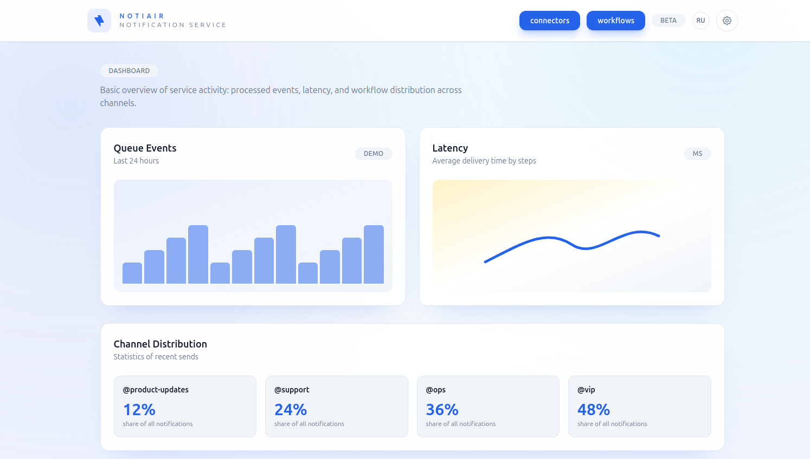
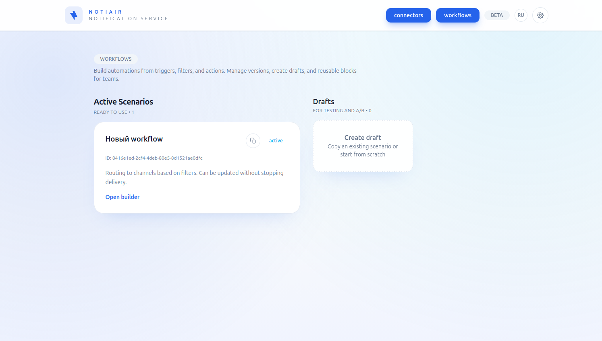
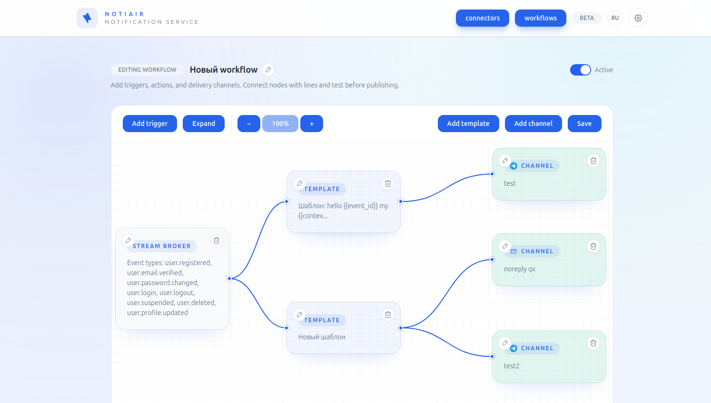
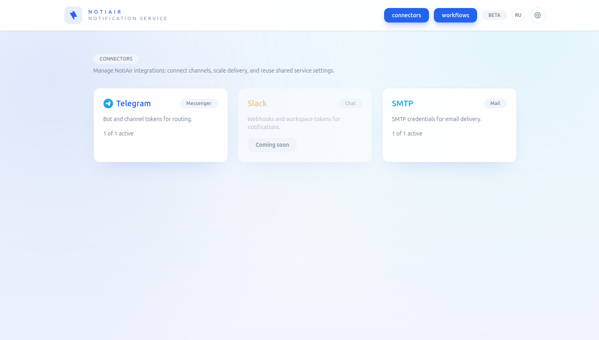
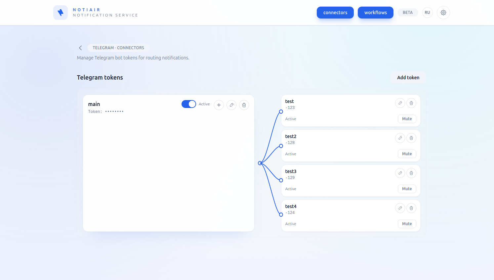

<div align="center">
  
  <h1>NotiAir</h1>
  <p><strong>Система управления уведомлениями: визуальные workflow, шаблоны сообщений и асинхронная доставка.</strong></p>
  <p>
    <a href="./README.md">English</a>
  </p>
</div>

---

## О проекте

NotiAir — платформа для создания и запуска сценариев уведомлений: шаблоны с переменными, визуальный конструктор workflow (условия, фильтры, маршрутизация) и асинхронная доставка по каналам (в т.ч. Telegram) с паттерном Outbox для надёжной отправки.

## Возможности

- **Шаблоны** — переменные, форматирование в духе Markdown, превью с тестовыми данными
- **Конструктор workflow** — drag-and-drop: триггеры, фильтры, действия, условная маршрутизация
- **Очереди** — Asynq на Redis, повторы, мониторинг задач
- **Доставка** — Outbox, Telegram Bot API, расширяемая модель каналов
- **Коннекторы** — настройка каналов (например Telegram) из интерфейса

## Архитектура

| Компонент | Назначение |
|-----------|------------|
| **Backend (Go)** | REST API (Fiber), PostgreSQL, Asynq/Redis, outbox, транспорт Telegram |
| **Frontend (SvelteKit)** | Редактор workflow и шаблонов, мониторинг очередей, коннекторы |

## Технологический стек

**Backend:** Go 1.24 · Fiber v2 · GORM · PostgreSQL · Asynq · Telegram Bot API  

**Frontend:** SvelteKit · TypeScript · Tailwind CSS · Bun · `@neodrag/svelte`

## Скриншоты

| Главный экран | Список workflow |
|---------------|-----------------|
|  |  |

| Редактор workflow | Коннекторы |
|-------------------|------------|
|  |  |

| Настройка коннектора |
|----------------------|
|  |

## Быстрый старт

### Требования

- Go 1.24+
- PostgreSQL 14+
- Redis 6+
- [Bun](https://bun.sh/) (фронтенд)
- Docker и Docker Compose (опционально)

### 1. Инфраструктура

```bash
cd .ops
docker compose up -d
```

### 2. Backend

```bash
cd api
cp .env.example .env
```

Пример `.env`:

```env
HTTP_ADDR=:8080
QUEUE_URL=redis://localhost:6379/0
QUEUE_NAMESPACE=notiair
TELEGRAM_BOT_TOKEN=your_bot_token
DB_HOST=localhost
DB_PORT=5432
DB_USER=postgres
DB_PASSWORD=postgres
DB_NAME=notiair
```

```bash
go run ./main.go
```

### 3. Frontend

```bash
cd client
bun install
bun dev
```

Обычно Vite поднимает приложение на `http://localhost:5173`.

## API (v1)

| Раздел | Метод и путь | Описание |
|--------|----------------|----------|
| Уведомления | `POST /v1/notifications/dispatch` | Отправка через workflow |
| Шаблоны | `GET/POST /v1/templates` | Список и создание/обновление |
| Workflow | `GET/POST /v1/workflows` | Список и создание/обновление |
| Очереди | `GET /v1/queues/pending` | Задачи в очереди |

## Разработка

Цели Make описаны в `.ops/Makefile`. Из корня репозитория: `make -C .ops <цель>` (рецепты `dev-api`, `dev-client`, `dev` рассчитаны на контекст `.ops`).

| Цель | Описание |
|------|----------|
| `build-api` | Образ `notiair:api-local` (`Dockerfile.api`, контекст — корень репозитория) |
| `build-client` | Образ `notiair:client-local` (`Dockerfile.client`) |
| `build-all` | `build-api`, затем `build-client` |
| `dev-api` | `go run ./main.go` в `api/` |
| `dev-client` | `bun dev` в `client/` |
| `dev` | `compose.dev.yml`, затем API и клиент; при выходе останавливает compose |

```bash
make -C .ops build-all
make -C .ops dev-api
make -C .ops dev
```

### Структура репозитория

```
notiair/
├── api/                 # Backend
│   ├── handlers/        # HTTP-обработчики
│   ├── internal/        # config, persistence, queue, routing, templates, transport, workflow
│   ├── routes/
│   ├── services/
│   └── main.go
└── client/
    └── src/
        ├── lib/         # API-клиент, компоненты, stores, типы
        └── routes/      # шаблоны, workflow, очереди, коннекторы (напр. connectors/telegram)
```

**Модули backend (кратко):** `internal/config` · `internal/persistence/*` · `internal/routing` · `internal/queue` · `services/` · `handlers/` · `routes/`  

**Frontend:** `lib/api` · `lib/components` · `lib/stores` · `lib/types` · `routes/*`
